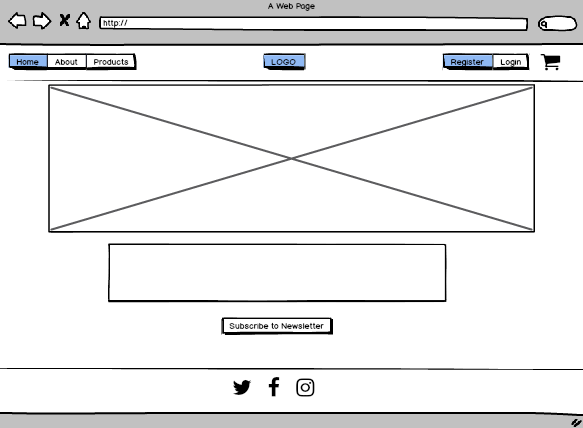
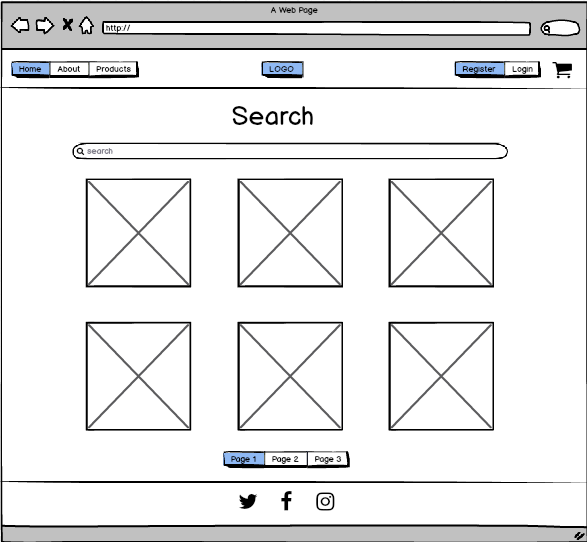
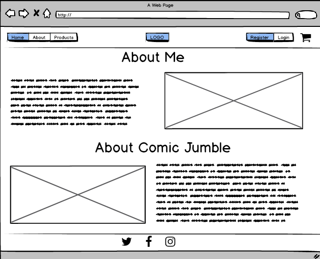
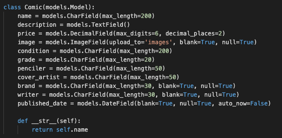
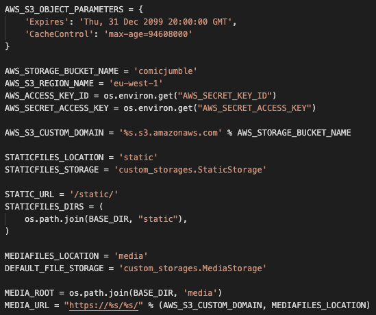

# Comic Jumble

Comic Jumble is a small online store selling second-hand comic books. The owner of Comic Jumble is selling comics from their own comic book collection because they want to downsize. The purpose of Comic Jumble is to display, describe and sell second-hand comic to comic lovers. This is a webapp created for **educational purposes only** - it is not an active store.

## UX

This is a simple app where customers can browse, view, purchase and give feedback on the product, a miscellaneous collection of comic books. The website is for comic book collectors and enthusiasts looking for specific issues of their favourite comics. As a user of this site I want / need / expect to:

- Browse and search for comics by publisher, grade and name
- Save comics to my cart and continue to browse
- Use my credit card at checkout to purchase what I want
- Get in touch with the site owner to share my feedback
- See additional information about the comics, like a plot description
- Find out the grade and condition of the issue I want to buy
- Be able to register to the website and then use my own login credentials
- Have the functionality to remove items from my cart if I change my mind
- See the store's privacy policy and its terms and conditions
- Get information on what each grade and condition means
- Read more about the site owner and their purpose for the store
- See cover art of the comics I want to buy
- Have access to a frequently asked questions page
- See how many items are in my cart at any given time
- Add my order information and card details at checkout
- See a summary of my cart items at checkout to refresh my memory

### Wireframes

These wireframes below, of the Home page, Search page and About page, are the first representations of Comic Jumble. As can be seen, the Search page has stayed the same throughout the project.

Home wireframe

Search wireframe

About wireframe

## Features

### Existing Features

All html pages extend from the base.html page where the navbar and footer live - these features appear on all pages. Unique content displays on each page by  and  tags. Here's more on both prime features:

- Navbar: Every page features the navbar which signals where users can find each page. The navbar hosts the following links: Home, Comics, Search, Cart, Register and Login. The navbar also shows a shortened version of the site's name so it can be viewed on each page. The navbar is responsive and the links collapse on smaller screens, and are replaced by a hamburger menu icon.

- Footer: This is a simple section signalling the end of the website on the page. In this section, the user will find additional pages that can be accessed by clicking the links. It also includes the logo which displays bigger on smaller devices.

### Home App

- Home page

  - The Home page displays a jumbotron and its main purpose is to highlight the mission of the website briefly. The container holding the jumbtron is one of a two elements that is set to 'fluid', meaning it fills the full width of the screen.

  - Info cards: these Bootstrap cards give the user a taste of what they can find on the website; here they can see that there's a glossary, comic store, faqs page and a way to contact the site owner. They are unlinked, but animated.

- About page

  - This page features a media element and brief text. Purely informational, this gives the user some detail about the purpose of the site and its owner.

- Contact page

  - This a page with minimal information and gives the user a way to contact the site owner. This page features a short form the user can fill in. The user can add their email subject, message and own email with the mesage and the email is sent to the site owner directly.

- Glossary page

  - This is a single page with a lot of textual information for the novice comic buyer. It gives information about why comics are graded in a certain way and gives more detail on what kind of conditions comics can be and what criteria is used.

  - This information is displayed in JavaScript collapsible element from W3Schools. On hover the item is black in color, which gives users a chance to see which term is currently active. By clicking on the term item, a dropdown appears with a definition for that term. User close the dropdown by clicking again. Multiple terms can be viewed at the same time.

- FAQs page

  - This page gives the user more information on why the site owner started the website. It has a question and answer format for easy reading.

- Privacy Policy page

  - This page was created using this [generator](https://www.privacypolicygenerator.info/). A page like this would be added to any store and website so I felt it was appropriate to it it here.

- Terms and Conditions page

  - Like the policy page above, a page like this would be available on any store so I added it to this website. It was generated [here](https://www.termsandconditionsgenerator.com/).

### Comics App

- Comics page

  - This is the page containing a list of all the products in the store, the comics. With style and information overload in mind, this page purposefully outlines the name, price and cover of the comic for sale. Additional information if provided in the Details page per comic.

  - With the cards, images are clickable and direct users to the Details page. There is also an Add to Cart button that adds the item to the customers cart and redirects them to the comics page.

  - Pagination has been added to this page in order to structure information and limit how much dislays on thage page. The customer will see nine comics on the comic page, and additional comics can be found by pressing the Next button at the end of the section.

- Details Page

  - Once a visitor clicks on a cover page displaying in the Comics page they will be taken to that item's detail page. Here they can see a larger version of the comic cover and find out specific information about the following: name, price, description, penciler, writer, cover artist, price, grade and condition of the comic.

  - On reading this page, if the customer wants to purchase the comic, they can use the Add to Cart button to put the item in their cart. Doing this also redirects the customer to the Comics page again so they can browse other comics.

  - Breadcrumbs feature at the top of the Details page. This acts as information for the customers on the comic they are viewing and is a way the customer can go back to the comics page or home page from the details page.

- Search page

  - On this page users can search for comics of their choice. They can enter text in the search bar and press the search button. Users can search for relevant comics by entering names, grades or publishers. For example, if the customer searches for Marvel comics, those comics will display.

  - Results are displayed immediately and are in the same form that can be found on the Comics page to keep uniformity - the comic cover, name and price. However, the size of the comics is a little smaller, which is to differentiate between comics on the Comic page. Clicking on a comic cover here will also redirect the user to the details page of that specific comic.

### Accounts App

- Login page

  - To proceed to checkout, users must login. Regular users can use this page to login and will find the page by clicking on the Login link in the navbar. Users log in by using their username and password. Once logged in, they are directed to the Index Page and see a succesful login message.

  - If a user has forgotten their password, they can use use the reset password link below the form.

- Register page

  - Users can register for the website by using the form on this page. New users can register by adding their email address, desired username, password and the password must be confirmed. Then the user can press the register button.

  - On registering, the new user will be redirected to the Index Page and will see a sucess message display under the navbar. If they are unsuccessful they will see a message explaining this.

- Reset pages

  - Outside the Accounts App, but relevant to this section, are the reset password pages. You can find these pages in a separate folder in the top level Templates folder.
  
  - Users can find the reset password route when they go through the Reset Form. There is a link to this form at the bottom of the Login page. When the user enters their email address, they receive a reset link to this address.

  - When reset link is pressed, users are directed to a new form where they can change their password. Once completion of this, users then see the reset complete form prompting them to login using their new credentials.

### Checkout App

- Checkout page

  - On the site, users can find the checkout page by clicking on the Checkout button on the Cart page. Users must be logged in to proceed to checkout and will be directed to do so if not logged in.

  - At checkout, there are two forms: the order form and the payment form. Here users will add all relevant information in order to complete checkout.

  - On successful completion at checkout, users will see a success message at the to top of the page and will be directed to the Comics page in case they want to purchase more items. If a user is unsuccessful, they will also see a message.

### Cart App

- Cart page

  - This page can be accessed by clicking on the Cart link in the navbar, which is visible on every page. Users will see a brief explanation of the cart and the checkout button.

  - If there are items in the cart, the user will see them display above the total. The items are smaller than displayed on the Comics page to differentiate between pages.

  - When users click Add to Cart buttons throughout the site, a yellow badge appears beside the cart link and icon - users are not directed to the cart page unless they click the link in the navbar. This is so users can continue to browse. The badge helps the user see how many items are currently in the cart.

  - Customers also have the option to remove the item from the cart when on the Cart page. This ensures users have more control over what they purchase and facilitates a change of mind.

### Features Left to Implement

- Forum

  - This would enable purchases of the comics to give feedback and chat to peers about the comics they've bought. It would also give the site owner a way to see where their comics have ended up. Additionally, once the comics are sold, the store would be disabled and the forum would take precedent.

- Guest shopping

  - For users who want to purchase comics but don't want to sign up to the site, this feature would give them a way to do this. This would be in the form of an extra button called 'Guest' that displays when users are prompted to login.

- Contact Form

  - Instead of users having to email in via the mailto link in the footer, users would be able to access a form on the site, which they would fill in. Once they hit send, the email would be sent directly to the store's owner.

- Social links

  - Twitter, Facebook, YouTube and Instagram icons were removed at final stage of project because the store does not have any social accounts and it would be a bad user experience to keep them linked with no destination. Once the site owner has social accounts to link to, they will be re-added in the footer section.

- Profile page

  - Once logging in the user would be directed to their own Profile page. It would be personalised for them and information including comic favourites, past orders and the ability to edit personal information would be available to the user.

## Information Architecture

### Data models

- Comics model

  - The Comic model is the main source of information given from the administator to the user. Here I added fields for information that comics lovers were likely to want to know, including name of comic and condition of comic. See all fields here:

  

- Order model

  - This model is necessary for order and payment information to complete checkout by users of the site and is set with Stripe in mind to process orders.

- SQLite3

  - This database was used for testing purposes pre-deployment. It enabled me to set up automated testing when running the tests I had written for views and urls. For use post-deployment, ensure PostgreSQL database url if commented out in environment variables.

PostgreSQL

- This database was added via an add-on on Heroku's side is the primary database for the site. When testing, use SQLite3 instead. This database was initialised by using python3 manage.py makemigrations and python3 manage.py migrate.

## Technologies Used

### VSCode

On my local machine I used VSCode to add and edit my code. This enabled me to download my own necessary dependencies and packages. You can download VSCode for your machine on [Visual Studio Code](https://code.visualstudio.com/docs/setup/setup-overview)'s website. You can add extensions to help with your project. Use its source control tab to commit and push changes to your local repository.

### Django

This web application framework is used to create the entire app and is written in Python. It is installed via pip3 install django(ADD VERSION) through your code editor. Once you add your project using django-admin startproject PROJECTNAME (dot), then you'll have access to Settings.py, URLs.py and other files. Then you can add apps, which are smaller self-contained components within the project.

### HTML5

HTML is the standard markup for web pages and stands for Hyper Text Markup Language. It is used to add and maintain structure for the content of information on web pages on the app. In conjunction with Bootstrap's grid system, the HTML supports all content on the site. The base.html page is created first by declaring its HTML5 structure using <!DOCTYPE html> and then addition elements, including head, title and body elements.

### Django's templating language

A template system is incorporated in this project. First, create your base.html and then in additonal pages add  to the top of the page. This means anything on the base.html page will display on the new page. The unique code is written between  and  placeholders in each other page. Templating is very helpful when avoiding repeated coding structures and when displaying the navbar and footer on each page, for example.

### CSS3

Custom CSS and style attributes have been added via an external CSS stylesheet that is added to the head of the base.html file - CSS is rendered on each page that extends from the base.html page. While the CSS sheet contains most code, other styling attributes have been added inline using style tags in the HTML structure and for Bootstrap's inline spacing and color specifications.

### JavaScript

In this project JavaScript was used primarily for the Stripe set up, using an external stripe.js file which is the library that Stripe itself provides. It helps users on a store complete checkout and enables the developer to collect important and private payment information safely. More information on this can be found on [Stripe](https://stripe.com/docs/stripe-js). JavaScript was also copied from W3schools for the collapsible feature on the glossary page. And Bootstrap is dependent on JavaScript and its library, along with jQuery and Popper.js is added to the base.html page.

### jQuery

This was used to make some Bootstrap elements functional. For example, the collapsible navbar on mobile and its ability to be tapped into a dropdown was created visually with CSS, but only works because of the jQuery that is involved. The jQuery library is added to the head element.

### Bootstrap 4

This technology aides in the development of information structure on the page. This service provides well-designed, structured containers that require little additional modification. Aside from components on the page, Bootstrap is also used for its grid layout, which enables my app to be responsive on all devices. Its emphasis on spacing by padding and margin on the x and y axis has been employed inline throughout the html code per page: mx-auto for margin-right and margin-left automatic spacing, for example.

### Heroku

This platform is used to build, run and deploy the project and is hosting my project in production. It hosts the database used in project too, PostgreSQL. You need to create an app, set config variables and then deploy. See Heroku Deployment for more indepth information.

### SQLite3

This database, by default, comes with the Django package and is used primarily in development. Tables within the database are created using modelsa and using python3 manage.py makemigration and then migrate. In production this set up is mirrored in the new PostreSQL database.

### PostgreSQL

This is the database used in production. It can be accessed as an add-on feature in Heroku at multiple pricing brackets, including a free tier. Go to the Resources tab and in the add-on section, type in PostgreSQL to see options. Initialise the database by python3 manage.py makemigrations and migrate.

### Github

Github is my local repository. Here you can see the development of the code I've added, from the first file to the last. To start you initialise git by typing in 'git init' in your terminal and then you can add commit messages that when pushed to the repository can be viewed online. Its purpose is version control, to highlight the changes of the code during the project.

### Balsamiq

This technology is generally used at the start of a project, during the Skeleton Plane, to plot out the look of the app and its primary pages. In the formation of the project, it helps to visualise elements pre-coding but you can also use it to develop pages mid-project.

### Travis

This is a tool for continuous integration and testing. Its purpose is to test smaller chunks of code continously. After pushing changes to Github Travis will let you know if your code passes the requirements you've set. When Travis is synced up to Github repository you can see if your build passes or fails and then see your project's build history.

### Google Fonts

The font used on the site is Quicksand with font weights of 400, 500 and 700 to differentiate between different types of text - paragraph, heading and special text, for example. While it is possible to add additional weights and styles of this font, I used minimal specifications to keep my site loading quickly.

### Code Institute

Course material provided by Code Institute, including the e-commerce mini-project and deployment tutorials, were studied for this project.

### W3Schools

For Javascript code on the Glossary page and for assistance with formatting comments for HTML, CSS and Python.

### Validators

W3C's [Markup Validator](https://validator.w3.org/) was used for HTML validation. W3C's [CSS Validator](https://jigsaw.w3.org/css-validator/) was used to validate my CSS file. In addition to these validators, Pycodestyle (formerly known as pep8) was installed to my local machine and highlighed Python style code conventions.

### S3 Amazon Web Services

Static files and media files were added to this platform for hosting. To set this up, create an account at [Amazon Management Console](https://aws.amazon.com/console/). Create a new bucket for your project, then click static website hosting. Add CORS configuation and bucket policy, set permissions to public. Create a new group and user with names associated with the project.

You'll need to set up a custom_storages.py file to set static and media file storage locations that are then pushed to S3. AWS secret and access keys will be accessible to your on creating a user on S3's side. Finally, ensure 'storages' is added to Installed APPs, and that you've used pip3 install Django-storages
pip3 install boto3 in your requirements.txt file.

When testing, to see changes on the site, of CSS for example, you'll need to use python3 manage.py collectstatic (add DISABLE_COLLECSTATIC = 1 to Heroku's config vars) to push changes to S3's side.

## Testing

### Continous Integration - Travis

From the beginning of this project, Continuous Integration - which means to test code in smaller chunks more often - was employed. In this project, Travis was used. To set this up, you'll need an account with Travis > connect it to the Github repository. Add a .travis.yml file to the root directory of your project, where language, version, requirements and script are specified - you'll also need a dummy SECRET_KEY. See below for an example:

Then the first build takes place, which takes a few seconds as Travis tests all the code submitted. A build icon can be placed at the top of your README.md file, which is used to keep track of passing or failing code. When you click on the build icon you'll be redirected to the Travis website to see the build's code history.

### Manual testing by feature

1. Navbar: Go to the website on desktop and click each link in the navbar to be directed to relevant pages. On mobile or iPad, tap on the links via the hamburger menu icon.
2. Informational boxes: On the Index page on desktop hover over this section to see the animation. On mobile and iPad, tap sections.
3. Comics: Go to the Comics page and click on a cover image. You'll be taken to the details page of that comic. Click on Add to Cart and you'll find your item in your cart.
4. Cart: In the cart, delete an item from the cart by clicking on the Remove button. You will stay on the cart page, but the item disappears.
5. Logging in: Click the login link and fill in the form, you can now proceed to checkout and are logged in.
6. Logging out. Only visible if logged in already. Click the Logout link in the navbar - redirect to index page and success message displays.
7. Register form. Click the Register link in the navbar then fill out the form with your credentials. You will use those new credentials when logging in.
8. Password Reset: Click the forgot my password link, go to your email inbox and click reset link. Add and confirm new password. Login using new credentials.
9. Search: Type in Marvel, DC or BOOM! Studios to find relevant comics. Search by name and grade too.
10. Glossary: Hover over items to see item turn black, click on item to expand for more information. Click again to hide information.
11. Click on the Contact link in the footer for mailto link option. From here send an email directly to Comic Jumble.
12. Click links in the footer to take your to corresponding page. Links are highlighted in blue when clicked.

### Automated testing

Tests were written in this project and stored in Test folders in multiple apps. There are 21 automated tests overall and they are designed to test that views display with page status 200 and urls link to correct views.

To run tests, use python3 manage.py test (ADD APP NAME) on your local machine - ensure PostgreSQL database has been commented out in Env.py file so the tests use the testing database SQLite3. On doing this you'll see how long the tests take to run and an OK message.

For writing tests, add separate test_views and test_urls files and always start each test class with 'def test' so the test can be picked up. Additionally, when adding new Test folders ensure an __init__.py file is added so the tests can found. There's more inforrmation on Django testing [here](https://docs.djangoproject.com/en/3.0/topics/testing/overview/).

### Issues and bugs

|  Number  | Issue  |  Resolution  |  
|---|---|---|
|  1  | Users not directed to checkout after loggin in | Add 'next' = /?next=/checkout/ and if / else for users who are already or  not logged in |
|  2  |  Too many comics on comics and search pages |  Add pagination class and logic to display nine comics per comics page, four per search  |
|  3  |  Search queries by other criteria not possible |  Add logic so user can search by name, grade and publisher   |
|  4  |  Gmail configuration for reset links not working | Use SendGrid instead   |
|  5  | Comic names can be too long  | Truncate name field by chars  |
|  6  |  Logic behind contact form not working |  Use mailto link instead |
|  7  |  Overcrowding on navbar |  Remove unnecessary icons and add additional pages as links in footer |
|  8  |  Not being able to navigate out of details page |  Add breadcrumbs to top of comics and details pages so users can go back |
|  9 | Bootstrap navbar menu icon limited color options  |  Remove Bootstrap icon and use Font Awesome icon instead |
|  10  |  Whitespace displaying on right side of mobile | Use container > row > col divs together in that order  |

Unresolved issue: footer on pages with less content, how to stay fixed to the bottom of the page on all viewports.

## Deployment

### Running the project locally

This project was created, developed on run locally using a MacBook Air and VSCode as an IDE. To start the project, first create a workspace on your local machine and then open the folder on VSCode or an IDE of your choice. Add the README.md file as the first file and then create a .gitignore file in anticipation for the files that would need to be ignored for the project.

Following this, create a virtual environment using Python3 -m venv env and then activate it by opening a new terminal on your IDE. Next, install Django by using pip3 install Django==1.11.28 - or another version of your choice. Then add your project folder - in my case it's 'mycomicjumble' - in order to access the Settings.py file and additional files for the project.

Before initialising git and pushing to your local repositiory on Github, ensure that the SECRET_KEY contained in the Settings.py file has been added to an env.py file - this file stores all the environment variables needed throughout the project and makes sure important private inforamtion isn't pushed to Github. Then initialise git, add a commit message and then push everything to your online repository. For me, this is at Github - accessible [here](https://github.com/adonegan/milestone4-mycomicjumble).

The project is now visible and accessible locally by using python3 manage.py runserver on your IDE. To exit the project, press Control-C, if using VSCode. Initialise the database and create tables within it by using python3 manage.py migrate. Following this, add a base.html page as a top level file for the project and when adding new apps (by using python3 manage.py startapp Home, for example) extend the base.html file to new pages.

### Heroku Deployment

Deploying to Heroku can take place at the start, in the middle or at the end of the project. I deployed my project to Heroku at the end of the project so I could focus on the build in development.

To deploy, create an app in your Heroku account. In the resources tab you can opt for a PostgreSQL database for the project - I chose the free one for this project. Selecting this database option pushed my Database URL to the config vars section in the Settings tab in Heroku.

Locally, use pip3 to install dj-database-url to your project - this is so the PostgreSQL database can be supported. In the Settings.py file comment out the SQLite database that comes with Django in favour of using Heroku's PostgreSQL database. Use this code: DATABASES = {'default': dj_database_url.parse(os.environ.get("DATABASE_URL"))} and import dj_database_url at the top of the Settings.py file. In addition to this, insall psycopg2-binary==2.8.4 and gunicorn for Heroku deployment.

Add all keys and urls in the env.py file to the config vars section of the Settings tab within Heroku so they can be supported there. Use python3 manage.py makemigrations and python3 manage.py migrate to create tables in the database. Then create a superuser by using python3 manage.py createsuperuser - this is done again here (like the first time with the SQLite database) because PostgreSQL is the new database.

Static and Media files are served through Amazon Web Services S3 (see Technologies for more information on this) and once that is set up, use pip3 freeze --local > requirements.txt to ensure all dependencies are in place. After this, create the Procfile, which is needed for Heroku to determine what type of app it is (web: gunicorn mycomicjumble.wsgi:application is mine, for example).

When the Heroku app url is generated, add it - via an environment variable - to the ALLOWED_HOSTS section in the Settings.py file. When the project is complete, change Debug = False.

## Credits

- The text for the glossary page, in the Grades and Conditions sections, was copied from [My Comic Shop](https://www.mycomicshop.com/help/grading) and modifed by me.

- Comic cover images were sourced from: [Marvel](marvel.com)'s official website, [BOOM! Studio](www.boom-studios.com)'s official website, and [DC](https://www.dccomics.com/)'s website. Additional images and information were sourced from [Fandom](https://www.fandom.com/).

- The text for comics on each details page was copied aned edited from official publisher websites, as linked above, and Fandom.

- Text on the [Privacy Policy](https://www.privacypolicygenerator.info/) page was generated from. Likewise, text on the [Terms & Conditions](https://www.termsandconditionsgenerator.com/) page is from.

- Logo from [Squarespace Logo](https://www.squarespace.com/logo#N4IghgrgLgFgpgExALigJwnAvkA).

- Assistance with pagination from Rafiqul Hasan's documentation [here](http://shopnilsazal.github.io/django-pagination-with-basic-search/).

- Anna G milestone four [documentation for House of Mouse](https://github.com/AJGreaves/thehouseofmouse) was an inspiration.

- Images on About page and FAQs page sourced through Ecosia search engine.
